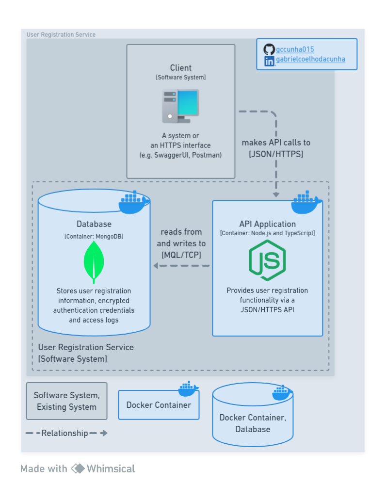

# Node.js User Registration Service

  

## About

REST API service to register users.

### Built with

[![Node.js][nodejs-badge]][nodejs]
[![TypeScript][typescript-badge]][typescript]
[![MongoDB][mongodb-badge]][mongodb]
[![Docker][docker-badge]][docker]

(<a href="#nodejs-user-registration-service">back to top ⬆️</a>)

## Getting started

### Prerequisites

### Installation

(<a href="#nodejs-user-registration-service">back to top ⬆️</a>)

## Usage

(<a href="#nodejs-user-registration-service">back to top ⬆️</a>)

## Roadmap

<ul type="none">
  <li>✅ Add C4 container diagram</li>
  <li>✅ Define database schema</li>
  <li>⬜ Implement, test and document API
    <ul type="none">
      <li>⬜ Implementation</li>
      <li>⬜ Unit testing</li>
      <li>⬜ Integration testing</li>
      <li>⬜ E2E testing</li>
      <li>⬜ Add Swagger on route <code>/docs</code></li>
    </ul>
  </li>
  <li>⬜ Add C4 deploy diagram</li>
  <li>⬜ Deploy demo</li>
</ul>

(<a href="#nodejs-user-registration-service">back to top ⬆️</a>)

## Acknowledgments

- Diagrams based on [C4 model] and made with [Whimsical]
- [GitHub icon][github-logos] by [GitHub]
- [LinkedIn icon][linkedin-brand] by [LinkedIn]
- [MongoDB icon][mongodb-press-kit] by [MongoDB]
- [Node.js][icons8-nodejs], [Docker][icons8-docker] and [Computer][icons8-computer] icons by [Icons8]
- [BDD in Action - Behavior-Driven Development for the whole software lifecycle][bdd-in-action]

(<a href="#nodejs-user-registration-service">back to top ⬆️</a>)

<!-- Markdown links and images -->

[nodejs]: https://nodejs.org/en
[nodejs-badge]: https://img.shields.io/badge/Node.js-3C873A?style=for-the-badge&logo=node.js&logoColor=white
[typescript]: https://www.typescriptlang.org
[typescript-badge]: https://img.shields.io/badge/TypeScript-358EF1?style=for-the-badge&logo=typescript&logoColor=white
[mongodb]: https://www.mongodb.com
[mongodb-badge]: https://img.shields.io/badge/MongoDB-001e2b?style=for-the-badge&logo=mongodb&logoColor=00ed64
[mongodb-press-kit]: https://brandfolder.com/mongodb/press-kit
[docker]: https://www.docker.com
[docker-badge]: https://img.shields.io/badge/Docker-0db7ed?style=for-the-badge&logo=docker&logoColor=white
[c4 model]: https://c4model.com
[whimsical]: https://whimsical.com
[github]: https://github.com
[github-logos]: https://github.com/logos
[linkedin]: https://linkedin.com
[linkedin-brand]: https://brand.linkedin.com/downloads
[icons8]: https://icons8.com
[icons8-nodejs]: https://icons8.com/icon/hsPbhkOH4FMe/node-js
[icons8-docker]: https://icons8.com/icon/cdYUlRaag9G9/docker
[icons8-computer]: https://icons8.com/icon/Qh2tCGOAtV52/workstation
[bdd-in-action]: https://www.manning.com/books/bdd-in-action
